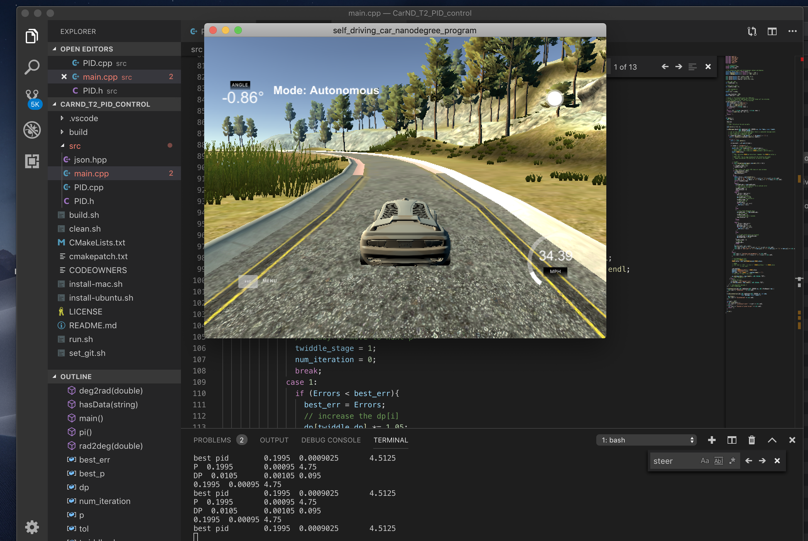

# CarND-Controls-PID
Self-Driving Car Engineer Nanodegree Program

---

## Basic Build Instructions

1. Clone this repo.
2. cd to this repo foler.
3. bash ./build.sh
4. bash ./run.sh
5. bash ./clean.sh

## PID
cte_sum += cte;
cte_diff = cte - cte_pre;
steer_value = -Kp*cte - Ki*cte_sum - Kd*cte_diff

## Reflections 

This PID control algorithm and parameters twiddle are coded based on the instructions. Although the twiddle parameters will find the optimal parameters, some manually twiddle for the initial `p` and `dp` are still needed to prevent the eco car drive out of road when the PID controller trying to converge. Thus, a good understanding of environments is important for PID control.

The `p` and `dp` are {0.01, 0.001, 0.1} and {0.2, 0.0, 5}. The best parameters are found as `pid.Init(0.1995, 0.0009, 4.5125)` (kp, ki, kd). 

Some PID twiddle references:
1. https://classroom.udacity.com/nanodegrees/nd013/parts/30260907-68c1-4f24-b793-89c0c2a0ad32/modules/3e2b027e-1822-4638-a58a-def1e64258a8/lessons/48c5e9c4-f72b-4c7c-8375-ea4eda220e39/concepts/87d07dd3-70f3-46a0-b35c-c8528792d90f
2. https://github.com/rtsaad/CarND-Controls-PID